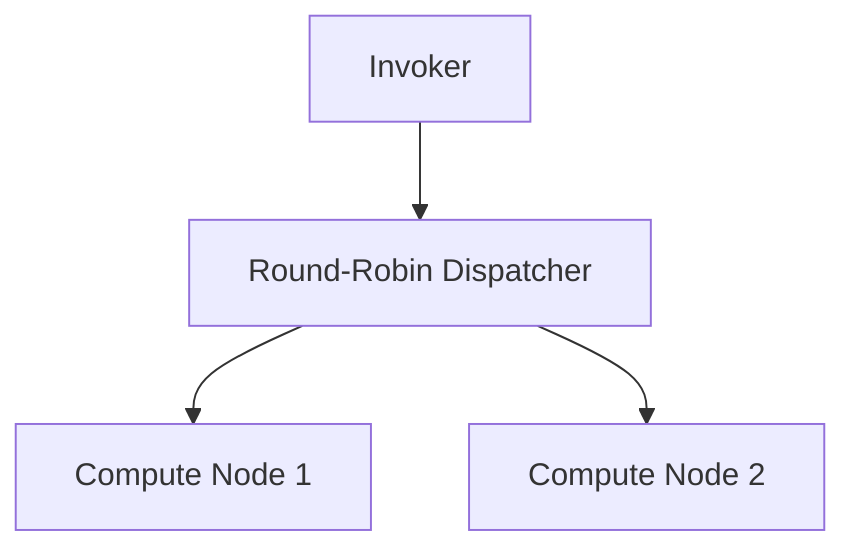

# Future Features & Roadmap Ideas

A backlog of potential features for the portfolio website, grouped by theme. Prioritisation is rough — items marked ⚡ are high-impact relative to effort.

---

## Interactive Project Pages

The biggest differentiator for a portfolio is making projects feel _alive_ rather than just described.

### ⚡ Mermaid.js Architecture Diagrams
Render architecture diagrams inline in MDX using Mermaid syntax. Supports flowcharts, sequence diagrams, entity-relationship diagrams, Gantt charts, and more. Extremely low friction to author — just write the diagram as a code block with `mermaid` as the language.

**Effort:** Low. Add `rehype-mermaid` or render client-side with `mermaid.js`.

---

### ⚡ draw.io / Excalidraw Diagram Embeds
Support `.drawio` XML files stored in the repo, rendered inline on project pages via the draw.io viewer. Good for complex system architecture diagrams where Mermaid is too limiting. Excalidraw is an alternative with a hand-drawn feel.

**Effort:** Medium. Store `.drawio` files in `public/diagrams/`, embed via the draw.io iframe API or a React wrapper.

---

### Interactive Code Playground
Embed a live, editable code sandbox directly in a project page. Users can read the code explanation, then tweak and run it in-page.

Options:
- **Sandpack** (by CodeSandbox) — React-native, offline-capable, supports many runtimes
- **Monaco Editor** (VS Code's editor) — for read-only syntax-highlighted, copyable snippets with a richer editor feel
- **CodeSandbox / StackBlitz embeds** — full project embeds via iframe

**Effort:** Medium. Sandpack is the easiest to integrate into an MDX workflow.

---

### Animated Terminal / Command Demos
Show CLI tools, build steps, or benchmark runs as animated terminal output rather than static code blocks. Great for the AutoNDP load balancer project to show benchmark results "playing out".

Libraries: `react-terminal-ui`, `xterm.js`, or a custom CSS animation over a `<pre>` block.

**Effort:** Low–Medium. Can start with CSS keyframe animation on a `<pre>` block, graduate to full xterm.js if needed.

---

### ⚡ Live Demo Embeds
Embed deployed demos directly on the project page in an iframe or a full-width panel with a fallback link. Works especially well for web-based projects.

Extend the `AdminProject` type to support a `demoUrl` field (already exists in the data model but isn't displayed prominently). Render it as a large "Try it live" button or embedded iframe.

**Effort:** Low. The `demoUrl` field already exists — just needs a prominent UI treatment.

---

### Three.js / WebGL Interactive Demo (Arche Engine)
For the Arche 3D physics engine specifically: ship a WebAssembly build of the engine and render it in-browser using Three.js or raw WebGL. Let visitors drag and drop objects, toggle gravity, etc.

**Effort:** High. Requires compiling Arche to WASM and building a Three.js wrapper. Worth it as a centrepiece project demo.

---

### Benchmark / Results Charts
Display benchmark data as interactive charts (bar, line, box plot) directly in project pages. Particularly relevant for the AutoNDP latency results. Users can hover over bars to see exact values, toggle data series, etc.

Libraries: `recharts` (React-native, small bundle), `Chart.js` via a wrapper, or `visx` (D3-based).

**Effort:** Low. Define a `benchmarks` MDX component that takes JSON data and renders a `recharts` chart.

---

### GitHub PR / Commit Activity per Project
Show a live feed of recent commits, open PRs, and issues for each project, pulled from the GitHub API. Makes projects feel actively maintained.

**Effort:** Low. The GitHub metrics API is already partially built (`/api/admin/github-metrics`). Extend it to a public-facing endpoint and display on the project page.

---

## Blog Enhancements

### ⚡ Reading Progress Indicator
A thin progress bar fixed at the top of the page that fills as you scroll through a post. Standard UX for long-form technical writing.

**Effort:** Very Low. A `useScrollProgress` hook + a `
` with dynamic `width` style.

---

### ⚡ Code Block Copy Button
Add a "Copy" button to every `<pre>` code block. Currently the syntax highlighting is good but there's no copy affordance.

**Effort:** Very Low. A custom `rehype` plugin or a client component that wraps each `<pre>` block.

---

### Post Reactions / Comments (Giscus)
Allow readers to react to posts (👍 🎉 🤔) and leave comments, backed by GitHub Discussions. Zero backend — all data lives in GitHub. Respects existing GitHub auth.

**Effort:** Low. Drop in the `giscus` script/React component, configure the repo and discussion category.

---

### Related Posts
At the bottom of each post, show 2–3 related posts based on overlapping tags. Keeps readers engaged.

**Effort:** Low. Pure static computation at build time — compare tag arrays, sort by overlap count.

---

### ⚡ RSS / Atom Feed
Generate an RSS feed for blog posts at `/rss.xml`. Important for readers who use feed readers. Also signals to search engines that this is an actively updated blog.

**Effort:** Low. A dynamic Next.js route that serialises the posts array as XML.

---

### Estimated Reading Time (auto-calculated)
Auto-calculate reading time from the content word count rather than requiring it to be entered manually in the admin form. Remove the manual field and derive it at render time (~200 words/minute).

**Effort:** Very Low. A `countWords(content)` helper in the data layer.

---

### Full-Text Search
Add client-side search across all blog posts and projects. Filter by title, description, tags, and even post body.

Options:
- **Fuse.js** — fuzzy search, zero backend, works offline
- **Pagefind** — static site search, indexes at build time, very fast

**Effort:** Low–Medium. Fuse.js is fastest to integrate.

---

### Draft Post Support
Add a `draft: true` flag to posts/projects. Drafts are excluded from listing pages and `generateStaticParams` but can be previewed via a special `/preview?slug=...` route requiring admin auth.

**Effort:** Medium.

---

## Site-Wide Features

### ⚡ Open Graph / Social Preview Images
Generate dynamic OG images for each blog post and project using `@vercel/og` (or `satori` + `sharp`). Shows the post title, date, and a branded background when the URL is shared on Twitter/LinkedIn/Slack.

**Effort:** Low. A single `/api/og?title=...&date=...` route.

---

### ⚡ Structured Data (JSON-LD)
Add `Article` and `TechArticle` JSON-LD schema to blog posts and project pages. Improves how Google displays the pages in search results (including rich snippets showing author, date, and reading time).

**Effort:** Very Low. A server component that injects a `<script type="application/ld+json">` tag.

---

### Analytics (Privacy-Friendly)
Add page view and event tracking without cookies or GDPR consent banners. See which posts and projects get the most traffic.

Options:
- **Plausible** — hosted, ~$9/month, no cookies
- **Umami** — self-hosted on a free Supabase/Railway instance, fully free

**Effort:** Very Low. One script tag + optional event tracking.

---

### Contact Form with Email Delivery
A proper contact form on the `/contact` page that sends an email via **Resend** (simple API, good free tier). Currently the contact page likely just shows links.

**Effort:** Low. A Next.js API route that calls the Resend SDK.

---

### Interactive Skills / Technology Graph
A force-directed or hierarchical graph (D3.js or `react-force-graph`) showing your technology skills as nodes connected by relationships (e.g., "Faasm" → "C++", "serverless", "distributed systems"). More interesting than a flat tag list.

**Effort:** Medium.

---

### Project Timeline / Journey View
An interactive vertical timeline showing all projects and experience in chronological order. Clicking a node expands details. Shows the arc of your development as an engineer.

**Effort:** Medium. Framer Motion is already in the project — can use layout animations.

---

### Dark / Light Theme Toggle (Full)
The `ThemeContext` exists but the site is effectively dark-only. Completing the light theme would make the site accessible in bright environments and is a common portfolio polish point.

**Effort:** Medium. Mainly CSS work — the Tailwind `dark:` variant infrastructure is probably already partially there.

---

### Print / PDF Export for Blog Posts
A "Download as PDF" button on blog posts, generated server-side using `puppeteer` or `playwright` on a Netlify function. Useful for academic-style posts.

**Effort:** High. Puppeteer on serverless is possible but heavy.

---

## Admin Portal Improvements

### Image Manager
A dedicated admin page that lists all images in `public/images/`, shows thumbnails, file sizes, and which posts/projects reference each image. Allows deletion of unused images.

**Effort:** Medium.

---

### Content Preview Mode
Before saving, show a live preview of how a post will look when rendered, including MDX compilation and syntax highlighting. Side-by-side editor + preview layout.

**Effort:** Medium. The MDX compilation already works — the challenge is running it client-side in the admin without a full server round-trip. `next-mdx-remote/client` can help.

---

### Autosave / Version History
Auto-save drafts to `localStorage` with timestamps. Show a list of recent auto-saves and allow restoring any of them. Prevents losing work if the browser tab is accidentally closed.

**Effort:** Low. The session storage persistence is already partially there — extend it with a timestamped history array.

---

### Bulk Image Upload
Allow selecting multiple images at once in the image upload field, queuing them and uploading sequentially.

**Effort:** Low.

---

## SEO & Performance

- **`sitemap.xml`** — Auto-generated from all static routes. Next.js 13+ has built-in support via `app/sitemap.ts`. (**Very Low**)
- **`robots.txt`** — Currently admin pages are excluded via `metadata.robots`. A proper `robots.txt` file at the root would be more standard. (**Very Low**)
- **Image optimisation pipeline** — Automatically convert uploaded images to WebP and generate multiple sizes at upload time, rather than relying entirely on Next.js `<Image>` optimisation at runtime. (**Medium**)
- **Lighthouse score tracking** — Run Lighthouse in CI on each PR and fail if scores drop below a threshold. (**Low**)
