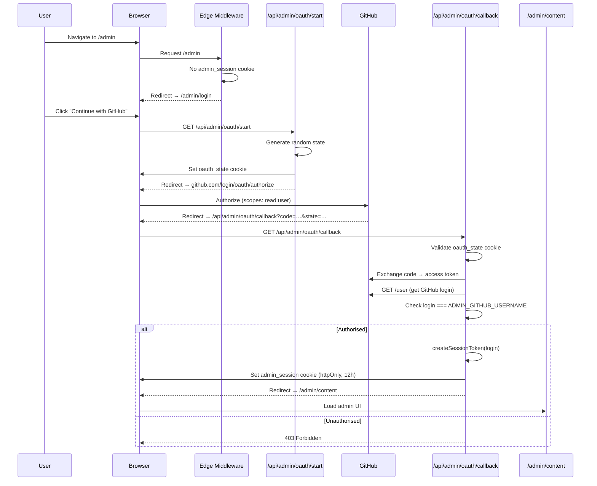
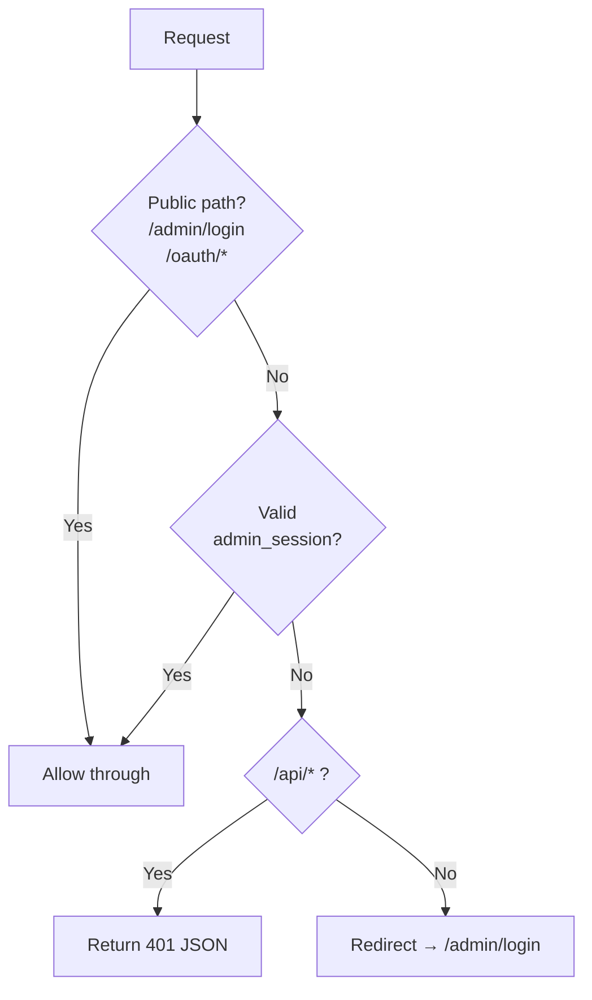
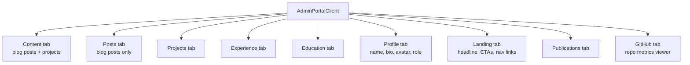
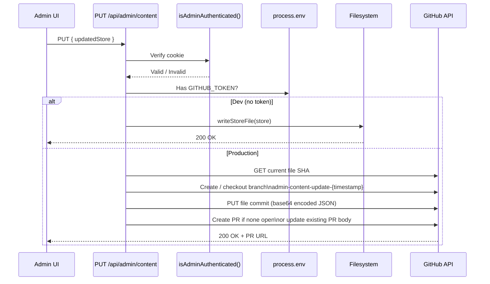

# Admin Portal

The admin portal lets an authorised GitHub user edit all site content through a browser UI. In production, saves create a GitHub pull request rather than writing directly to the deployed site.

---

## Authentication Flow



---

## Session Tokens

Sessions are stateless — no database required. The token is an HMAC-signed string stored in an `httpOnly` cookie.

**Token format:**
```
<githubLogin>:<timestamp>:<hmac-sha256-signature>
```

**Verification:**
- Signature validated with timing-safe comparison (prevents oracle attacks)
- Timestamp checked — tokens expire after 12 hours
- `ADMIN_SECRET` env var is the HMAC key

**Key functions** (`src/lib/admin/auth.ts`):
- `createSessionToken(githubLogin)` — signs and returns token string
- `verifySessionToken(token)` — validates signature + expiry
- `isAdminAuthenticated(request)` — reads cookie and calls verify

---

## Middleware Protection

`src/middleware.ts` runs at the edge on all `/admin/*` and `/api/admin/*` requests.



**Rate limiting:** `/api/admin/oauth/start` is capped at 10 requests per IP per 60 seconds using an in-memory sliding window.

---

## Admin UI Structure

The main UI lives in `AdminPortalClient` (`src/components/pages/AdminPortalClient.tsx`). It's a single client component with tab navigation.



Each tab loads and saves the relevant slice of `admin-content.json` via the `/api/admin/content` endpoint.

---

## Content Save Flow



**Branch naming:** `admin-content-update-<unix-timestamp>`

**PR title:** `Admin content updates`

**Commit message:** `Admin: update site content (via admin UI)`

After the PR is merged, Netlify detects the push to `main` and triggers a rebuild, which re-runs `generateStaticParams` and picks up the new content.

---

## GitHub Image Upload

Images (e.g. avatars, post covers) are uploaded via `POST /api/admin/upload-image`. The endpoint commits the binary file to the GitHub repo (base64 encoded) using `githubSync.ts → commitFileToBranch()`. The committed URL is then stored in the JSON store.

---

## Environment Variables Required

| Variable | Purpose |
|---|---|
| `ADMIN_SECRET` | HMAC key for signing session tokens |
| `ADMIN_GITHUB_USERNAME` | Only this GitHub login is granted access |
| `GITHUB_OAUTH_CLIENT_ID` | OAuth app client ID |
| `GITHUB_OAUTH_CLIENT_SECRET` | OAuth app secret |
| `GITHUB_TOKEN` | Personal access token for creating PRs (prod only) |
| `GITHUB_REPOSITORY` | `owner/repo` for PR target (prod only) |
