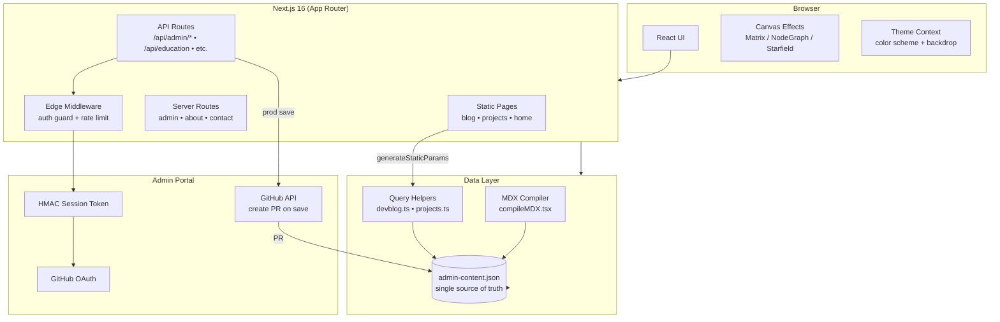

# Architecture Overview

A Next.js 16 (App Router) portfolio site with a built-in admin portal, single-file JSON content store, SSG-first rendering, and pluggable canvas backdrop effects.

## Tech Stack

| Layer | Technology |
|---|---|
| Framework | Next.js 16 (App Router) |
| UI | React 19, TypeScript 5 |
| Styling | Tailwind CSS 4, Framer Motion 12 |
| Content | next-mdx-remote 6, rehype-pretty-code |
| Icons | lucide-react |
| Deployment | Netlify (`@netlify/plugin-nextjs`) |
| Auth | GitHub OAuth (custom HMAC sessions) |
| Analytics | @vercel/analytics |
| Fonts | Space Grotesk, JetBrains Mono (Google Fonts) |

---

## High-Level System Diagram



---

## Key Architectural Decisions

### 1. Single JSON Source of Truth
All content (posts, projects, experience, education, profile, etc.) lives in `src/data/admin-content.json`. In production this file is webpack-bundled so Netlify serverless functions can access it without filesystem reads. In dev it reads from disk.

### 2. SSG-First Content Pages
Blog and project pages use `generateStaticParams()` — every post is pre-built to static HTML at build time. No server rendering required for content delivery.

### 3. Parallel Routes for Modal Overlays
`/blog/[slug]` and `/projects/[slug]` are intercepted by `@modal` parallel slots. Clicking a card from the listing page renders the post as a modal overlay rather than navigating away. Sharing the direct URL loads the full page.

### 4. Admin via GitHub PR
When content is saved in production, the API creates a branch, commits the updated JSON, and opens/updates a pull request. Changes are reviewed before going live rather than writing directly to the deployed filesystem.

### 5. Atomic Design Component Hierarchy
Components are organised atoms → molecules → organisms → pages. See [`components.md`](./components.md) for the full hierarchy.

### 6. Theme as CSS Variables
The active color scheme and backdrop are managed in `ThemeContext`. The context writes `data-color-scheme` and `data-mode` attributes to `<html>`, which CSS variables pick up. No class toggling needed.

---

## Repository Layout

```
src/
├── app/                  # Next.js App Router (routes, layouts, API)
│   ├── @modal/           # Parallel slot — intercepted blog/project overlays
│   ├── admin/            # Protected admin pages
│   ├── api/              # Serverless API routes
│   ├── blog/             # Blog listing + [slug] post pages
│   ├── projects/         # Projects listing + [slug] post pages
│   ├── about/            # About page
│   ├── contact/          # Contact page
│   ├── layout.tsx        # Root layout (fonts, providers, NavBar)
│   └── page.tsx          # Home page
├── components/           # Atomic design hierarchy
│   ├── atoms/            # ~36 base UI primitives
│   ├── molecules/        # ~21 composed components
│   ├── organisms/        # ~30 feature-level sections
│   ├── pages/            # ~13 full-page layouts
│   └── context/          # ThemeContext
├── hooks/                # Canvas animation hooks + scroll
├── lib/                  # Business logic, helpers, themes
│   ├── admin/            # Auth, store I/O, GitHub sync
│   ├── compileMDX.tsx    # MDX compiler
│   ├── themes.ts         # Color schemes + backdrop definitions
│   ├── devblog.ts        # Blog query helpers
│   └── projects.ts       # Project query helpers
├── data/
│   └── admin-content.json  # ← single source of truth
└── middleware.ts         # Edge auth guard + rate limiting
```

---

## Environment Variables

| Variable | Required In | Purpose |
|---|---|---|
| `NEXT_PUBLIC_BASE_URL` | Both | Canonical site URL |
| `ADMIN_SECRET` | Both | HMAC secret for session tokens |
| `ADMIN_GITHUB_USERNAME` | Both | Only GitHub user allowed in admin |
| `GITHUB_OAUTH_CLIENT_ID` | Both | OAuth app client ID |
| `GITHUB_OAUTH_CLIENT_SECRET` | Both | OAuth app secret |
| `GITHUB_TOKEN` | Production | Creates PRs on content save |
| `GITHUB_REPOSITORY` | Production | `owner/repo` for PR target |

---

## Build & Deploy

```bash
npm run dev        # Turbopack dev server
npm run build      # SSG production build
npm run start      # Production server
npm run lint       # ESLint
npm run format     # Prettier (single quotes, semicolons, 100-char, LF)
```

Deployed to **Netlify** via `@netlify/plugin-nextjs`. Static pages served from CDN; API routes become Netlify Functions.
