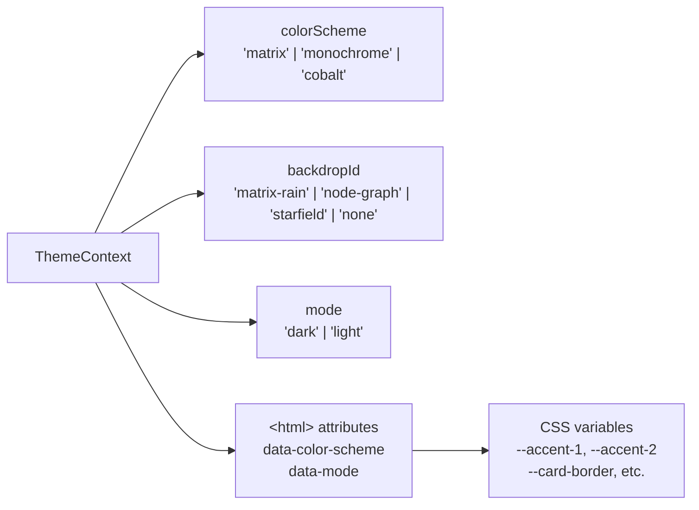
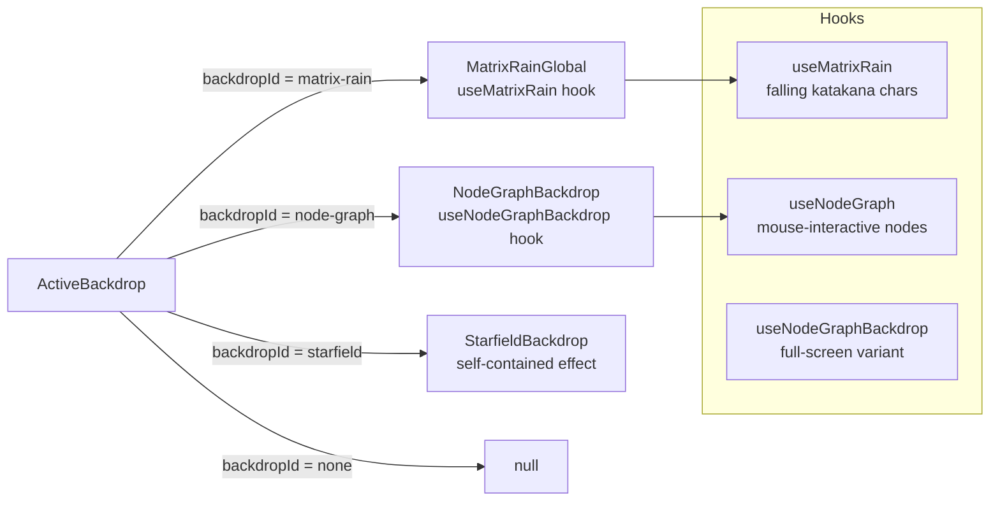
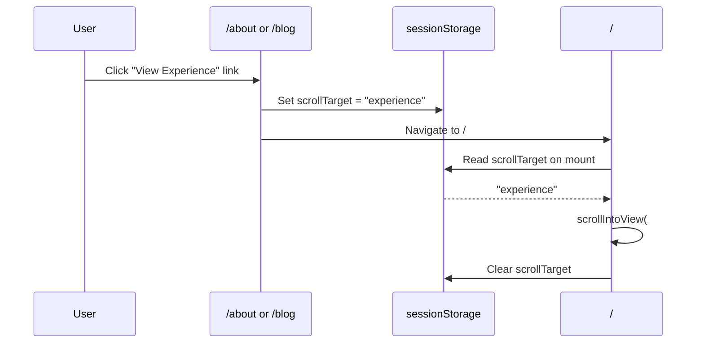

# Component Architecture

Components follow the Atomic Design methodology: atoms → molecules → organisms → pages. Each layer composes from the one below it.

---

## Hierarchy Overview

```mermaid
graph TD
    subgraph Pages["Pages (~13)"]
        LP[LandingPage]
        CPP[ContentPostPage]
        APP[AboutPageClient]
        APC[AdminPortalClient]
        BPI[BlogPostInner]
        PDP[ProjectDashboardPage]
    end

    subgraph Organisms["Organisms (~30)"]
        NB[NavBar]
        HS[HeroSection]
        EL[ExperienceList]
        ES[EducationSection]
        SS[SkillsSection]
        PG[ProjectGrid]
        CPC[ContentPostCard]
        FX[ActiveBackdrop]
        MR[MatrixRain]
        NG[NodeGraph]
        SF[StarfieldBackdrop]
        PO[ProjectOverlay]
    end

    subgraph Molecules["Molecules (~21)"]
        CF[ContentFilter]
        SEC[Section]
        NM[NavMenu]
        MDX[MDXContent]
        TP[ThemePanel]
        PC[ProjectCard]
        EC[EducationCard]
        JC[JobCard]
    end

    subgraph Atoms["Atoms (~36)"]
        BTN[Button]
        ICO[Icon]
        TAG[ProjectTag]
        HT[HeroTitle]
        NL[NavLink]
        SPB[ScrollProgressBar]
        TT[ThemeToggle]
        CE[CanvasElement]
        MRR[MatrixRainRender]
    end

    Pages --> Organisms
    Organisms --> Molecules
    Molecules --> Atoms
```

---

## Atoms

Base primitives — single responsibility, no composition of other components.

| Component | Purpose |
|---|---|
| `Button` | Base button with variant styles |
| `Icon` | Lucide icon wrapper with size/color props |
| `NavLink` | Styled anchor for navigation |
| `HeroTitle` | Large gradient hero heading |
| `ProjectTag` | Pill tag for content categories |
| `SkillTag` | Pill tag for skills |
| `Tag` | Generic tag pill |
| `ScrollProgressBar` | Reading progress indicator |
| `ThemeToggle` | Color scheme / backdrop toggle button |
| `TypingText` | Animated typewriter text |
| `Avatar` | Circular profile image |
| `Logo` | Site logo mark |
| `CanvasElement` | Reusable `<canvas>` with ref forwarding |
| `MatrixRainRender` | Canvas element wired to matrix rain hook |
| `RadialGradientOverlay` | SVG/CSS radial gradient layer |
| `CardImage` | Image with aspect-ratio constraint for cards |

---

## Molecules

Composed from atoms. Represent discrete UI concepts but not full page sections.

| Component | Purpose |
|---|---|
| `ContentFilter` | Tag pills + search input for filtering blog/project listings |
| `Section` | Titled section wrapper with consistent spacing |
| `NavMenu` | Horizontal/vertical nav link list |
| `MDXContent` | MDX provider — wraps compiled MDX with prose styles and custom element overrides |
| `ThemePanel` | Dropdown/drawer with color scheme and backdrop pickers |
| `ProjectCard` | Card for project listings (molecule variant — image + title + excerpt + tags) |
| `EducationCard` | Education entry display card |
| `JobCard` | Single role within an experience entry |
| `ContactForm` | Name/email/message form with submit |
| `TagList` | Renders an array of Tag atoms |
| `MetaRow` | Date + author + read-time metadata row |
| `AuthorMeta` | Avatar + author name inline |
| `HeroSummary` | Short bio text below hero title |
| `ExcerptBlock` | Styled excerpt paragraph |

---

## Organisms

Feature-level components that represent complete page sections.

| Component | Purpose |
|---|---|
| `NavBar` | Sticky top nav with logo, links, theme toggle, mobile menu |
| `HeroSection` | Landing hero — headline, subheadline, CTAs, hero image |
| `ExperienceList` | Timeline of experience entries with expandable roles |
| `ExperienceShowcase` | Alternative experience display (card grid) |
| `EducationSection` | Education entries grid |
| `EducationList` | Alternative education list display |
| `SkillsSection` | Skills grouped by category |
| `InterestsSection` | Interests with icons |
| `AwardsSection` | Awards list |
| `CertificationsSection` | Certifications list |
| `PublicationsSection` | Academic publications list |
| `ProjectGrid` | Responsive grid of project cards |
| `ProjectCard` | Full project card with image, status badge, tags, links |
| `ProjectOverlay` | Modal overlay container for intercepted project routes |
| `ProjectHeroStrip` | Full-width hero image strip for project detail |
| `ProjectStatCards` | Stats row (stack, role, status, date) for project detail |
| `ContentPostCard` | Blog/project card for listing pages |
| `ContentPostHeader` | Post title + meta header |
| `ContentPostBody` | Post body wrapper with max-width and typography |
| `FilterBar` | Tag + search filter bar (organism variant) |
| `CallToActionSection` | Full-width CTA banner |
| `AboutSidebar` | Profile sidebar for about page |
| `MatrixRain` | Canvas matrix rain effect (section-scoped) |
| `MatrixRainGlobal` | Full-page matrix rain backdrop |
| `ParallaxMatrixRain` | Scroll-parallax matrix rain variant |
| `NodeGraph` | Canvas node graph (section-scoped, uses `useNodeGraph`) |
| `NodeGraphBackdrop` | Full-page node graph backdrop (uses `useNodeGraphBackdrop`) |
| `StarfieldBackdrop` | Full-page starfield canvas effect |
| `ActiveBackdrop` | Switcher — renders whichever backdrop is selected in ThemeContext |

---

## Pages

Full-page layouts assembled from organisms. One per route, plus shared templates.

| Component | Route(s) | Purpose |
|---|---|---|
| `LandingPage` | `/` | Hero + experience + education sections |
| `ContentPostPage` | `/blog/[slug]`, `/projects/[slug]` | MDX post renderer with sticky TOC |
| `BlogPostInner` | `/blog/[slug]` | Blog-specific post layout wrapper |
| `ProjectDashboardPage` | `/projects/[slug]` | Project detail with stats, hero, MDX body |
| `AboutPageClient` | `/about` | Profile, skills, awards, certifications |
| `ContactPageContent` | `/contact` | Contact form + info |
| `AdminPortalClient` | `/admin/*` | Multi-tab admin UI panel |
| `ContentLandingPage` | `/blog` | Blog listing with filter |
| `BlogLandingPage` | `/blog` (variant) | Alternative blog listing layout |
| `ProjectsLandingPage` | `/projects` | Projects listing with filter |

---

## Context

### `ThemeContext` (`src/components/context/ThemeContext.tsx`)

Global state for the site's visual theme. Consumed by `NavBar`, `ActiveBackdrop`, and any component that needs accent colors.

---

## Canvas Effects

The backdrop system uses three canvas-based components, each with a corresponding hook:

`ActiveBackdrop` reads `backdropId` from `ThemeContext` and mounts the appropriate component. Theme changes swap the backdrop live without page reload.

---

## Scroll-to-Section Navigation

Home page sections (experience, education, etc.) can be deep-linked from other pages using `sessionStorage`:

