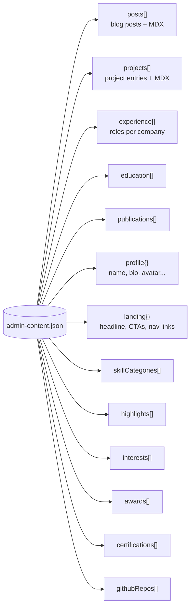
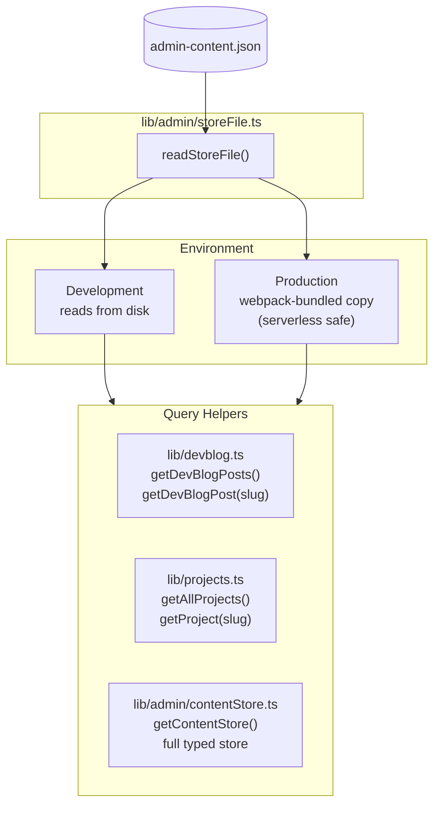
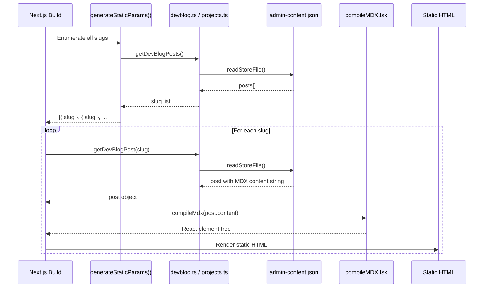
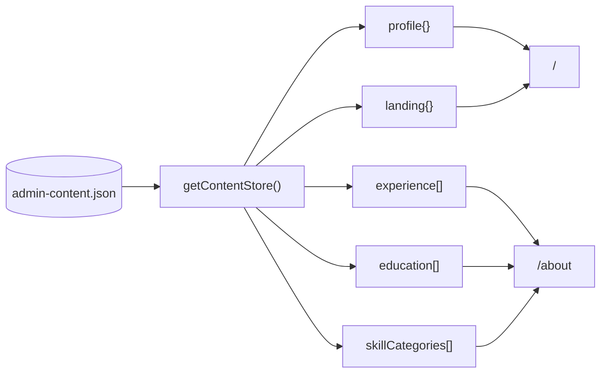
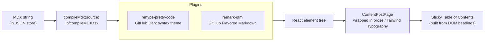
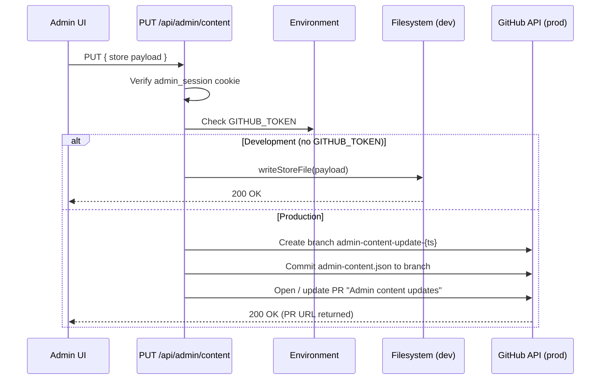

# Content System

All site content lives in a single JSON file. This document covers the data schema, how content flows to rendered pages, and how the MDX pipeline works.

---

## Data Store

**File:** `src/data/admin-content.json`

This is the single source of truth for everything on the site. It is never split across multiple files or a database.



---

## Store Access



`storeFile.ts` is the only file that touches the JSON. Everything else goes through the query helpers.

---

## Content Data Flow

### Blog / Projects (SSG)



### Home / About (SSG, no slug)



---

## MDX Pipeline

Blog posts and project write-ups are stored as raw MDX strings inside the JSON store. They are compiled server-side at build time.



**Key files:**
- `src/lib/compileMDX.tsx` — wraps `next-mdx-remote/rsc` with the plugin config
- `src/components/pages/ContentPostPage.tsx` — renders compiled MDX + generates TOC from headings
- `src/components/molecules/MDXContent.tsx` — applies `prose` classes and custom MDX component overrides

---

## Data Schema

### `AdminPost`
```typescript
{
  slug: string;
  title: string;
  date: string;           // ISO date string
  description: string;
  excerpt: string;
  tags: string[];
  image?: string;
  author?: string;
  content: string;        // Raw MDX string
}
```

### `AdminProject`
```typescript
{
  slug: string;
  title: string;
  date: string;
  description: string;
  excerpt: string;
  tags: string[];
  image?: string;
  repoUrl?: string;
  demoUrl?: string;
  author?: string;
  content: string;        // Raw MDX string
  status?: 'live' | 'wip' | 'archived';
  stack?: string[];
  role?: string;
  featured?: boolean;
  problem?: string;
  highlights?: string[];
  architectureDiagram?: string;
}
```

### `ExperienceEntry`
```typescript
{
  company: string;
  logoUrl?: string;
  websiteUrl?: string;
  roles: {
    role: string;
    dates: string;
    description: string;
    skills: string[];
    isCurrent?: boolean;
  }[];
}
```

### `ProfileData`
```typescript
{
  name: string;
  role: string;
  company: string;
  location: string;
  bio: string;
  statusLabel: string;
  avatarUrl?: string;
}
```

### `LandingData`
```typescript
{
  headline: string;
  subheadline: string;
  heroPhotoUrl?: string;
  primaryCtaLabel: string;
  secondaryCtaLabel: string;
  secondaryCtaHref: string;
  navLinks: { label: string; href: string; description?: string; icon?: string }[];
}
```

---

## Schema Migration

`src/lib/admin/contentStore.ts` includes a migration layer that normalises legacy JSON shapes to the current schema on read. This allows the store to evolve without a hard cutover — old data is quietly upgraded in memory.

---

## Admin Content Save Flow



In production, content changes never land directly on `main` — they always go through a PR that can be reviewed before merging and triggering a rebuild.
