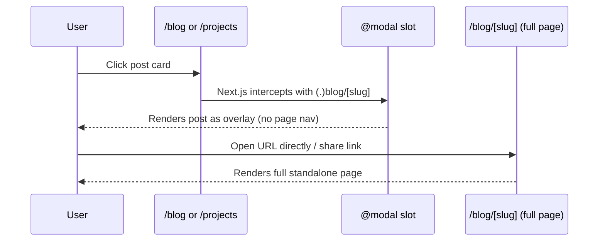
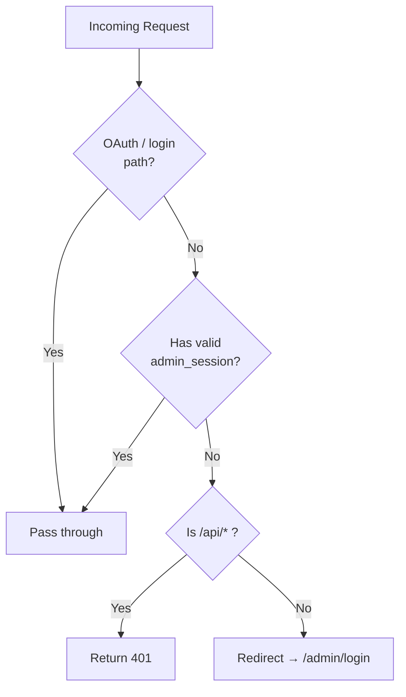

# Routing

Next.js 16 App Router. All routes live under `src/app/`.

---

## Route Map

```mermaid
graph LR
    Root["/"]

    Root --> Blog["/blog"]
    Blog --> BlogSlug["/blog/[slug]"]

    Root --> Projects["/projects"]
    Projects --> ProjectSlug["/projects/[slug]"]

    Root --> About["/about"]
    Root --> Contact["/contact"]

    Root --> Admin["/admin"]
    Admin --> AdminContent["/admin/content"]
    Admin --> AdminPosts["/admin/posts"]
    Admin --> AdminProjects["/admin/projects"]
    Admin --> AdminExperience["/admin/experience"]
    Admin --> AdminEducation["/admin/education"]
    Admin --> AdminProfile["/admin/profile"]
    Admin --> AdminLanding["/admin/landing"]
    Admin --> AdminPublications["/admin/publications"]
    Admin --> AdminGithub["/admin/github"]
    Admin --> AdminLogin["/admin/login 🔓"]

    Root --> API["/api"]
    API --> APIContent["/api/admin/content"]
    API --> APIOAuth["/api/admin/oauth/start\n/api/admin/oauth/callback"]
    API --> APILogout["/api/admin/logout"]
    API --> APIMetrics["/api/admin/github-metrics"]
    API --> APIUpload["/api/admin/upload-image"]
    API --> APIEducation["/api/education 🔓"]
    API --> APIExperience["/api/experience 🔓"]
    API --> APIPublications["/api/publications 🔓"]

    style AdminLogin fill:#334155
    style APIEducation fill:#334155
    style APIExperience fill:#334155
    style APIPublications fill:#334155
```

> All `/admin/*` and `/api/admin/*` routes are protected by edge middleware (session cookie check), except the login and OAuth callback paths marked 🔓.

---

## Public Routes

| Route | File | Rendering | Notes |
|---|---|---|---|
| `/` | `app/page.tsx` | SSG | Home — hero, experience, education sections |
| `/blog` | `app/blog/page.tsx` | SSG | Blog listing with client-side tag/search filter |
| `/blog/[slug]` | `app/blog/[slug]/page.tsx` | SSG | Individual post; `generateStaticParams` builds all slugs |
| `/projects` | `app/projects/page.tsx` | SSG | Projects listing |
| `/projects/[slug]` | `app/projects/[slug]/page.tsx` | SSG | Individual project; `generateStaticParams` |
| `/about` | `app/about/page.tsx` | SSG | Profile, skills, awards, certifications |
| `/contact` | `app/contact/page.tsx` | SSG | Contact form |

---

## Modal Overlay Routes (Parallel Slots)

The `@modal` parallel route slot intercepts navigation to blog/project pages when the user clicks from the listing page, rendering the post as an overlay instead of a full navigation.

| Intercepting Route | File | Intercepts |
|---|---|---|
| `@modal/(.)blog/[slug]` | `app/@modal/(.)blog/[slug]/page.tsx` | `/blog/[slug]` from listing |
| `@modal/(.)projects/[slug]` | `app/@modal/(.)projects/[slug]/page.tsx` | `/projects/[slug]` from listing |
| `@modal/default.tsx` | `app/@modal/default.tsx` | Returns `null` (no active modal) |

---

## Admin Routes

All require a valid `admin_session` cookie. Middleware redirects unauthenticated visitors to `/admin/login`.

| Route | Purpose |
|---|---|
| `/admin/login` | Public entry — "Continue with GitHub" button |
| `/admin` | Redirects to `/admin/content` |
| `/admin/content` | Main content editor (blog + projects) |
| `/admin/posts` | Blog posts editor tab |
| `/admin/projects` | Projects editor tab |
| `/admin/experience` | Experience entries editor |
| `/admin/education` | Education entries editor |
| `/admin/profile` | Profile info (name, bio, avatar, etc.) |
| `/admin/landing` | Hero headline, CTAs, nav links |
| `/admin/publications` | Academic publications editor |
| `/admin/github` | GitHub metrics viewer |

---

## API Routes

| Route | Method | Auth | Purpose |
|---|---|---|---|
| `/api/admin/content` | `GET` | Required | Fetch full content store |
| `/api/admin/content` | `PUT` | Required | Save store (PR in prod, disk write in dev) |
| `/api/admin/oauth/start` | `GET` | None | Begin GitHub OAuth (sets state cookie) |
| `/api/admin/oauth/callback` | `GET` | None | GitHub OAuth callback — issues session cookie |
| `/api/admin/logout` | `GET` | Required | Clears `admin_session` cookie |
| `/api/admin/github-metrics` | `GET` | Required | Fetches repo stats from GitHub API |
| `/api/admin/upload-image` | `POST` | Required | Commits image file to GitHub repo |
| `/api/education` | `GET` | None | Public — returns `education[]` from store |
| `/api/experience` | `GET` | None | Public — returns `experience[]` from store |
| `/api/publications` | `GET` | None | Public — returns `publications[]` from store |

---

## Edge Middleware (`src/middleware.ts`)

Runs on every request matching `/admin/:path*` and `/api/admin/:path*`.

Rate limiting (10 req / 60 s per IP) is also applied to the OAuth start endpoint.
