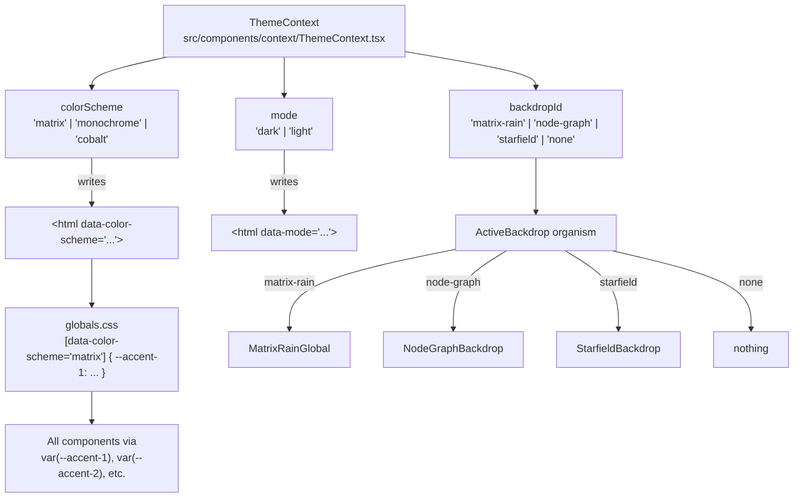

# Theme System

The theme system has two independent axes: **color scheme** and **backdrop effect**. Both are managed in `ThemeContext` and applied via CSS variables on the `<html>` element, so changes take effect instantly without re-rendering the page tree.

---

## Architecture



---

## Color Schemes

Defined in `src/lib/themes.ts` as `COLOR_SCHEMES`.

| ID | Name | Primary Accent | Secondary Accent | Character |
|---|---|---|---|---|
| `matrix` | Matrix | `rgb(74, 222, 128)` green-400 | `rgb(96, 165, 250)` blue-400 | Hacker / terminal |
| `monochrome` | Monochrome | `rgb(203, 213, 225)` slate-300 | `rgb(148, 163, 184)` slate-400 | Professional minimal |
| `cobalt` | Cobalt _(default)_ | `rgb(56, 189, 248)` sky-400 | `rgb(129, 140, 248)` indigo-400 | Electric blue |

Each scheme exposes:
```typescript
interface ColorScheme {
  id: string;
  name: string;
  description: string;
  accentRgb: [number, number, number];   // primary
  secondaryRgb: [number, number, number]; // secondary
}
```

The RGB tuples are passed directly as props to canvas backdrop hooks so effects match the active color scheme.

---

## CSS Variables

Set on `<html>` via `data-color-scheme` attribute. Components use these variables rather than hardcoded colours.

| Variable | Purpose |
|---|---|
| `--accent-1` | Primary accent color (buttons, highlights, active states) |
| `--accent-2` | Secondary accent color (gradients, hover states) |
| `--surface-base-rgb` | Base surface RGB for alpha-composited backgrounds |
| `--card-border` | Default card border color |
| `--card-border-hover` | Card border on hover |
| `--nav-bg-scrolled` | NavBar background when page is scrolled |
| `--nav-bg-unscrolled` | NavBar background at top of page |
| `--cta-glow-shadow` | Box shadow glow on CTA buttons |

---

## Backdrop Effects

Defined in `src/lib/themes.ts` as `BACKDROPS`. `ActiveBackdrop` reads `backdropId` from context and mounts the matching component.

### `node-graph` (default)

**File:** `src/components/organisms/NodeGraphBackdrop.tsx`
**Hook:** `src/hooks/useNodeGraphBackdrop.ts`

- Nodes drift slowly around the canvas
- Mouse cursor reveals connections within a configurable radius — nodes within range draw lines back to the cursor and grow slightly
- **Click anywhere** to trigger a BFS signal propagation — a faint pulse of light ripples outward through the network hop by hop
- Accent RGB passed as `accentRgb` prop so node/edge colour matches the active color scheme

### `matrix-rain`

**File:** `src/components/organisms/MatrixRainGlobal.tsx`
**Hook:** `src/hooks/useMatrixRain.ts`

- Columns of falling katakana characters at varying speeds
- Green accent colour (adapts slightly to scheme)
- Window resize handled via ResizeObserver

### `starfield`

**File:** `src/components/organisms/StarfieldBackdrop.tsx`
_(self-contained, no separate hook)_

- Stars distributed across canvas using screen-space back-projection (no vanishing point cluster)
- Variable star sizes via power distribution — mostly small, occasional large
- Large stars get a soft radial glow and a slowly rotating 4-point sparkle cross
- Twinkle via per-star sine oscillator
- Streak trail on stars close to camera
- **Easter egg:** every 18–40 seconds a small rocket flies across from a random screen edge with an animated flame exhaust

### `none`

No backdrop rendered. Clean dark background only.

---

## ThemePanel

`src/components/molecules/ThemePanel.tsx` — the user-facing switcher UI.

Renders:
- Color scheme picker (3 options with accent colour previews)
- Backdrop picker (4 options)
- Light/dark mode toggle

Accessed via `ThemeToggle` atom in the `NavBar`.

---

## Adding a New Color Scheme

1. Add an entry to `COLOR_SCHEMES` in `src/lib/themes.ts`:
   ```typescript
   {
     id: 'rose',
     name: 'Rose',
     description: 'Warm pink tones',
     accentRgb: [251, 113, 133],
     secondaryRgb: [244, 63, 94],
   }
   ```
2. Add matching CSS variable definitions in `src/app/globals.css`:
   ```css
   [data-color-scheme='rose'] {
     --accent-1: rgb(251, 113, 133);
     --accent-2: rgb(244, 63, 94);
     /* ... other vars */
   }
   ```
3. `ThemePanel` and `ThemeContext` pick it up automatically — no other changes needed.

## Adding a New Backdrop

1. Create the component in `src/components/organisms/`.
2. Add a `BackdropDef` entry to `BACKDROPS` in `src/lib/themes.ts`.
3. Add a `case` to `ActiveBackdrop.tsx` to mount it.
4. It will appear in `ThemePanel` automatically.
